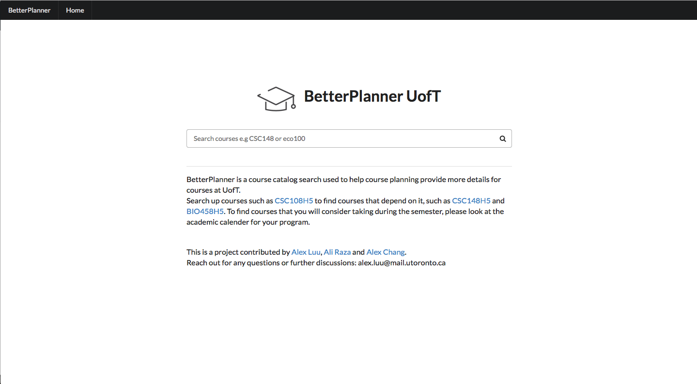

# BetterPlanner

### Description:

BetterPlanner is a course catalog search used to help course planning and provide more details for courses at University of Toronto. It provides with course descriptions at all three campuses and also provides prerequisites. A features which makes Betterplanner differ from searching courses on academic calendar is that it provides a "Necessary for" option for each course which lets the user know in future what courses have this course as a prerequisite. It provides links to those courses so the user can view them.

### Behind the scenes:

- Uses Python and flask as the backend server.
- Uses MongoDB to store all course at UofT.
- Uses Jinja to help with rendering server side html and css pages.
- On the frontend Semantic UI is used, with css and JS.
- Data for courses is synced with Cobalt to have up to date course info. (https://cobalt.qas.im/)
- Currently being Hosted on a Ubuntu server with a local MongoDB instance.MZ

